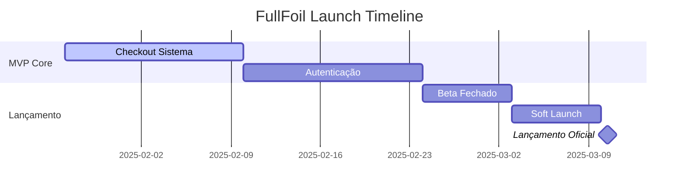

# 🚀 FullFoil - Roadmap de Lançamento

## 📅 Timeline de Lançamento



---

## ✅ O que já está pronto (Fase 5)

| Feature | Status | Descrição |
|---------|--------|-----------|
| 🛒 Carrinho de Compras | ✅ | Funcional com persistência local |
| 🎴 CardViewer 3D | ✅ | Rotação, zoom, flip, efeitos holográficos |
| 📊 Gráficos de Preço | ✅ | Histórico 30/90/365 dias |
| 📄 Paginação | ✅ | 50 cards/página com navegação |
| 🔔 Toast Notifications | ✅ | Feedback visual para ações |
| 🎮 5 TCGs Suportados | ✅ | Magic, Pokémon, Yu-Gi-Oh, Lorcana, One Piece |

---

## 🎯 MVP - Requisitos para Lançamento

### Prioridade 1: Crítico para Lançamento 🔴

#### **1. Sistema de Checkout (Fase 6)** - 2 semanas
```
[ ] Página de checkout multi-step
    [ ] 1. Revisão do carrinho
    [ ] 2. Informações de envio
    [ ] 3. Método de pagamento
    [ ] 4. Confirmação
[ ] Integração com gateway de pagamento
    [ ] Stripe (internacional)
    [ ] Mercado Pago (Brasil) - PIX, cartão
[ ] Cálculo de frete
    [ ] Integrar Correios API
    [ ] Ou Melhor Envio API
[ ] Emails transacionais
    [ ] Confirmação de pedido
    [ ] Atualização de status
```

#### **2. Autenticação Básica (Fase 7)** - 2 semanas
```
[ ] Registro de usuário
    [ ] Email + senha
    [ ] Validação de email
[ ] Login/Logout
    [ ] JWT tokens
    [ ] Hash de senhas (bcrypt)
[ ] Perfil básico
    [ ] Nome, email
    [ ] Endereços salvos
    [ ] Histórico de pedidos
```

---

### Prioridade 2: Importante para Experiência 🟡

#### **3. Landing Page de Lançamento**
```
[ ] Hero section impactante
    [ ] CTA principal: "Explore Cards"
    [ ] Animações premium
[ ] Features showcase
    [ ] 5 TCGs suportados
    [ ] Preview de cartas 3D
[ ] Newsletter signup
    [ ] Capturar emails para beta
[ ] Footer com links sociais
```

#### **4. SEO & Meta Tags**
```
[ ] Meta descriptions dinâmicas
[ ] Open Graph tags (Facebook/Twitter)
[ ] Favicon e app icons
[ ] robots.txt e sitemap.xml
```

---

### Prioridade 3: Nice to Have 🟢

#### **5. Polimento Visual**
```
[ ] Loading skeletons
[ ] Animações de transição
[ ] Dark/Light mode toggle
[ ] Onboarding tour
```

#### **6. Analytics**
```
[ ] Google Analytics 4
[ ] Hotjar ou similar (heatmaps)
[ ] Event tracking básico
```

---

## 📦 Checklist Pré-Lançamento

### Infraestrutura
- [ ] Domínio registrado (fullfoil.com.br ou similar)
- [ ] SSL certificado ativo
- [ ] Vercel production deployment
- [ ] Variáveis de ambiente configuradas
- [ ] Logs e monitoramento (Sentry)

### Legal
- [ ] Termos de Uso
- [ ] Política de Privacidade
- [ ] Política de Devolução
- [ ] LGPD compliance (Brasil)

### Marketing
- [ ] Logo final
- [ ] Redes sociais criadas
  - [ ] Instagram: @fullfoil
  - [ ] Twitter/X: @fullfoil
  - [ ] Discord server
- [ ] Imagens para compartilhamento
- [ ] Press kit básico

### Testes
- [ ] Teste de checkout completo
- [ ] Teste em mobile (iOS/Android)
- [ ] Teste de performance (Lighthouse > 90)
- [ ] Teste de acessibilidade básica

---

## 🗓️ Cronograma Sugerido

| Semana | Período | Foco |
|--------|---------|------|
| 1-2 | 27/01 - 09/02 | Sistema de Checkout |
| 3-4 | 10/02 - 23/02 | Autenticação + Landing Page |
| 5 | 24/02 - 02/03 | **Beta Fechado** (convidar 50-100 usuários) |
| 6 | 03/03 - 09/03 | **Soft Launch** (correções + feedback) |
| 🎉 | 10/03 | **Lançamento Oficial** |

---

## 📈 Métricas de Sucesso (30 dias pós-launch)

| Métrica | Meta |
|---------|------|
| Usuários registrados | 500+ |
| Taxa de conversão | > 2% |
| Pedidos completados | 100+ |
| Tempo de carregamento | < 2s |
| Taxa de rejeição | < 40% |
| NPS Score | > 40 |

---

## 🔥 Fases Pós-Lançamento

### V1.1 - Abril 2025
- Sistema de Wishlist
- Price Alerts por email
- Deck Builder básico

### V1.2 - Maio 2025
- Multi-vendedor (marketplace real)
- Seller dashboard
- Cart Optimizer

### V2.0 - Q3 2025
- App Mobile (React Native)
- Collection Tracker
- Buylist System

---

## 📝 Notas

> **Foco do MVP**: Não tente lançar com todas as features. O TCGPlayer levou anos para chegar onde está. Lance rápido, colete feedback, itere.

> **Stack Recomendada para Scale**:
> - Database: PostgreSQL (Supabase ou Neon)
> - Auth: Supabase Auth ou Auth.js
> - Payments: Stripe + Mercado Pago
> - Email: Resend ou SendGrid
> - CDN: Vercel Edge + Cloudflare

---

**Última atualização:** 27/01/2025  
**Próximo milestone:** Sistema de Checkout  
**Status:** 🟡 Em desenvolvimento
